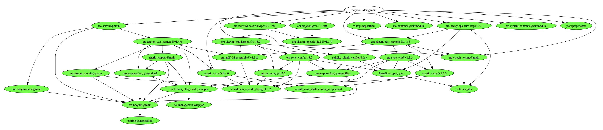

Small tool for repository management.

# analyse.py

Make sure to install:

```shell

python3 -m pip install tabulate termcolor

```

or

```shell

sudo apt install python3-tabulate python3-termcolor

```

# graph_me_up.py

If you are rate limited by GitHub (60 r, you can put your personal access token to `GH_TOKEN`

Make sure to install:

```shell
pip3 install graphviz
pip3 install requests
```

